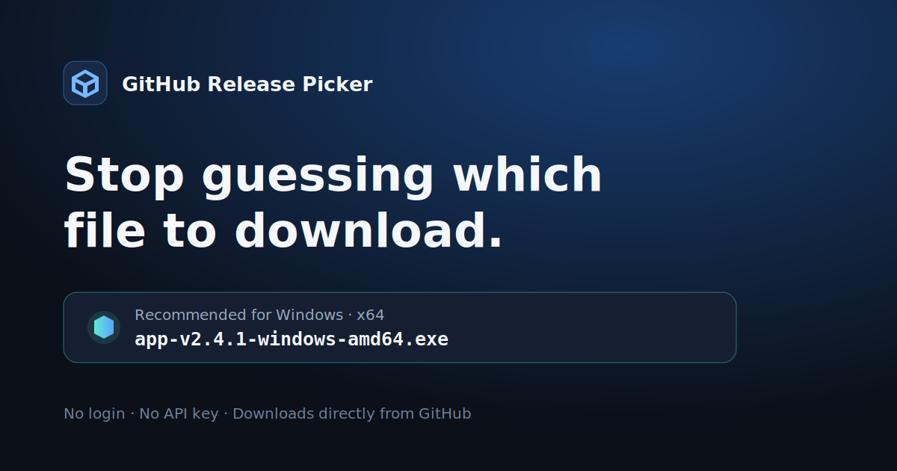

# GitHub Release Picker

Stop guessing which GitHub release file to download.

Paste an `owner/repository` name or a GitHub URL. Release Picker reads the latest public release, compares its assets with your operating system and processor architecture, and recommends the most suitable download with a plain-language explanation.



## Try it

**Web app:** https://configcrate.github.io/github-release-picker/

No installation, login, API key, or file upload is required.


[Watch the 18-second Chinese demo video](assets/video/github-release-picker-promo-zh.mp4)

## Why

A single GitHub release can contain Windows, macOS, Linux, x64, ARM64, installer, portable, checksum, signature, debug, and source files. Those labels are useful to developers but confusing to people who simply want the app.

Release Picker turns that list into one cautious recommendation. When filenames are ambiguous, it says so instead of pretending to know.

## Features

- Accepts `owner/repository`, repository URLs, and tagged release URLs.
- Detects Windows, macOS, or Linux when the browser exposes it.
- Detects x64 or ARM64 when possible and always lets the user correct it.
- Prioritizes common installers such as MSI, EXE, DMG, PKG, AppImage, DEB, and RPM.
- Excludes checksums, signatures, symbols, SBOMs, and incompatible builds from recommendations.
- Explains why one file is recommended and why the others are not.
- Downloads release assets directly from GitHub—no proxy and no modification.
- Automatically uses Chinese or English, with a manual language switch.
- Works on desktop and mobile as a dependency-free static site.

## Privacy

The app has no analytics, accounts, cookies, backend, or telemetry. Your device choice is stored locally in the browser. Public release metadata is requested directly from the official GitHub API.

GitHub applies an unauthenticated API limit to each IP address. If that limit is reached, the app explains the problem and asks the user to try again later. It never asks for a GitHub token.

## Accuracy and limitations

Release Picker uses filenames supplied by each project. There is no universal release-asset naming standard, and browsers do not always reveal processor architecture. The app therefore:

- shows the selected operating system and architecture before every lookup;
- uses confidence levels instead of claiming certainty;
- refuses to recommend a file when every candidate is incompatible or unclear.

Version 0.1 supports public repositories and the latest stable release (or a specific tag when its URL is pasted). Linux package-manager and distribution compatibility still requires the project's own documentation.

## Development

The project uses plain HTML, CSS, and JavaScript. Node.js is needed only for tests.

```bash
npm test
python -m http.server 4173
```

Then open `http://127.0.0.1:4173/`.

## 中文说明

GitHub 下载选择器用来解决一个很常见的问题：一个发行版有十几个文件，普通用户不知道应该下载 Windows、macOS、Linux、x64、ARM64、源码还是校验文件。

输入：

```text
configcrate/codex-titlebar-meter
```

或者粘贴完整的 GitHub 项目、Releases、特定版本链接，工具便会读取公开发行信息，根据你的系统和处理器挑选最合适的文件，并说明推荐理由。点击按钮后，文件仍然直接从 GitHub 官方地址下载。

### 使用特点

- 不用安装、不用登录，也不需要 API Key。
- 自动使用中文或英文，并可手动切换。
- 无法可靠识别 x64 或 ARM64 时，会让用户确认，不会盲目猜测。
- 会排除源码、校验文件、签名文件、调试文件和不兼容版本。
- 没有后端、账号、分析统计或遥测。
- 第一版仅支持公开项目。

[观看 18 秒中文演示视频](assets/video/github-release-picker-promo-zh.mp4)

---

Built by [ConfigCrate](https://configcrate.com/).

GitHub Release Picker is not affiliated with GitHub, Inc. GitHub is a trademark of GitHub, Inc.
